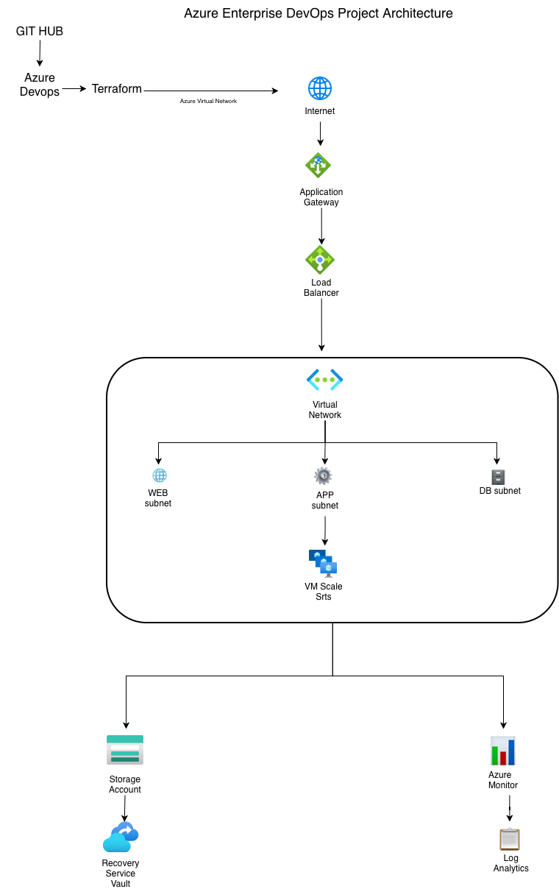

# 🚀 Enterprise Azure Infrastructure Automation using Terraform & Azure DevOps

   


## 📑 Table of Contents

- Project Overview
- Architecture Diagram
- Project Objectives
- Azure Services Used
- Technologies Used
- Repository Structure
- Infrastructure Components
- CI/CD Workflow
- Project Features
- Learning Outcomes
- Future Improvements
- Author

## 📖 Project Overview

This project demonstrates the design, deployment, and automation of an enterprise-grade Azure infrastructure using **Terraform** and **Azure DevOps**.

The objective of this project is to implement Infrastructure as Code (IaC), automate deployments through CI/CD, configure secure Azure networking, enable monitoring and backup, and document the complete deployment process following industry best practices.

This repository contains the complete implementation, architecture, deployment notes, and automation pipeline developed throughout a structured 30-day learning project.

---

# 🏗️ Architecture Diagram

The following diagram represents the Azure infrastructure deployed in this project.



---

# 🎯 Project Objectives

- Automate Azure infrastructure provisioning using Terraform
- Implement Infrastructure as Code (IaC)
- Configure enterprise Azure networking
- Deploy scalable compute resources
- Configure monitoring and logging
- Implement backup and recovery
- Build CI/CD pipelines using Azure DevOps
- Maintain infrastructure using Git and GitHub

---

# ☁️ Azure Services Used

| Service | Purpose |
|----------|---------|
| Azure Virtual Network | Secure network isolation |
| Application Gateway | Layer-7 load balancing |
| Azure Load Balancer | Layer-4 traffic distribution |
| Virtual Machine Scale Set | Scalable compute infrastructure |
| Azure Monitor | Infrastructure monitoring |
| Log Analytics Workspace | Log collection and analysis |
| Storage Account | Infrastructure storage |
| Recovery Services Vault | Backup and disaster recovery |
| Azure DevOps | Continuous Integration & Deployment |
| Terraform | Infrastructure as Code |
| GitHub | Source Code Management |

---

# 🛠 Technologies Used

- Microsoft Azure
- Terraform
- Azure DevOps
- Git
- GitHub
- Ubuntu Linux
- NGINX
- Visual Studio Code
- Azure CLI

---

# 📂 Repository Structure

```text
azure-enterprise-project/
│
├── architecture/
│   └── architecture.png
│
├── app/
│
├── terraform/
│
├── notes/
│   ├── day01.md
│   ├── day02.md
│   ├── ...
│   └── day30.md
│
├── screenshots/
│
├── azure-pipelines.yml
├── README.md
└── dcr.json
```

---

# 🚀 Infrastructure Components

The deployed infrastructure includes:

- Internet
- Application Gateway
- Azure Load Balancer
- Azure Virtual Network (VNet)
- WEB Subnet
- APP Subnet
- DB Subnet
- Virtual Machine Scale Set
- Azure Storage Account
- Recovery Services Vault
- Azure Monitor
- Log Analytics Workspace

---

# 🔄 CI/CD Workflow

```
Developer
      │
      ▼
 GitHub Repository
      │
      ▼
 Azure DevOps Pipeline
      │
      ▼
 Terraform Deployment
      │
      ▼
 Azure Infrastructure
```

---

# ✨ Project Features

- Infrastructure as Code using Terraform
- Automated Azure deployment
- Enterprise networking architecture
- Scalable compute using VM Scale Sets
- Application Gateway configuration
- Azure Load Balancer
- Azure Monitor integration
- Log Analytics Workspace
- Backup with Recovery Services Vault
- Azure DevOps CI/CD Pipeline
- Version control using GitHub
- Complete project documentation

---

# 📚 Learning Outcomes

This project helped me gain hands-on experience with:

- Azure Resource Management
- Terraform
- Infrastructure as Code
- Azure Networking
- VM Scale Sets
- Azure Storage
- Azure Monitoring
- Azure Backup
- Azure DevOps Pipelines
- Git & GitHub
- Enterprise Architecture Design
- Linux Administration

---

# 🚀 Future Improvements

- Deploy using Azure Kubernetes Service (AKS)
- Implement Azure Key Vault integration
- Add Azure Firewall
- Configure Application Insights
- Implement Blue-Green Deployment
- Add Auto Scaling Policies
- Integrate Security Center
- Deploy Multi-Region Infrastructure

---

# 👨‍💻 Author

**Manoj Billa**

GitHub: https://github.com/Billa118

---

# ⭐ If you found this project useful, consider giving it a star!